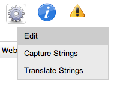
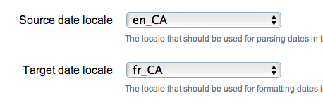
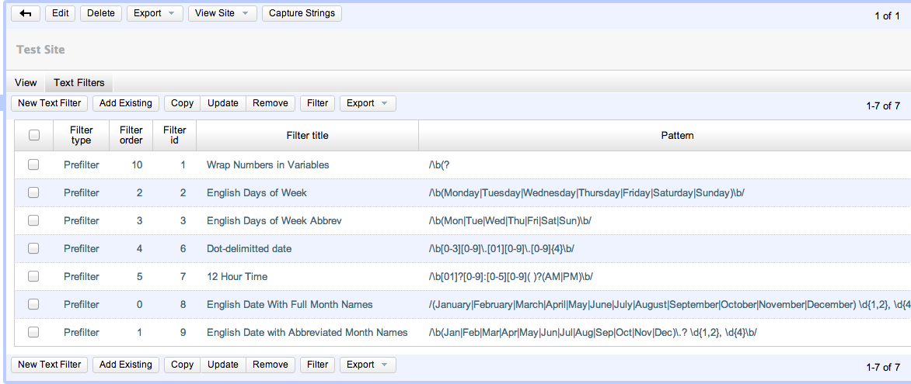
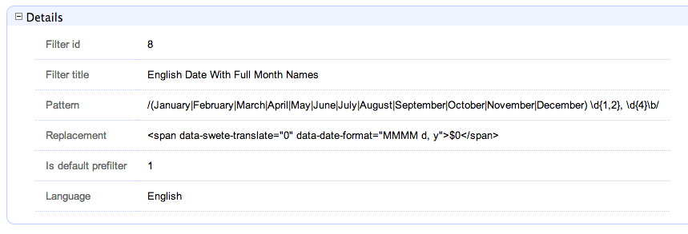

== The Translation Parser

SWeTE does a pretty good job of parsing HTML content and extracting a set of phrases to be translated. In cases where the HTML markup doesn't make structure explicit, you can add your own HTML tags and attributes to the content to help it along.

== How the Translation Parser Works

A request-response cycle in SWeTE works roughly as follows:

[arabic]
. Client makes an HTTP request for a page in the SWeTE proxy site.
. SWeTE loads the equivalent page from the source web server (or from the cache if the page is cached).
. SWeTE parses the source HTML page into a set of strings.
. For each string in the set of strings (from step 3), SWeTE checks the translation memory to see if there is a translation available for it.
. SWeTE replaces all strings in the HTML page with their appropriate translations if available.
. SWeTE returns the resulting (translated) page to the client.

This chapter will focus mostly on step 3 (parsing a webpage into strings). It is possible to use SWeTE successfully without understanding much about how the parsing works, but you can achieve much better results if you know how it works, and thus, know how to manipulate it.

== Block Level Elements vs Inline Elements

SWeTE's parsing algorithm is designed to figure out how the text of a page should be partitioned into strings. By default, SWeTE will look for what it considers to be "block-level" HTML elements. It treats the text content of each "block-level" as an atomic string (phrase) for use in translation. Block-level elements include such elements as:

* `+
+` tags (paragraphs)
* `+
+` tags
* `+<li>+` tags
* `+<h1>+`, `+<h2>+`, `+<h3>+`, etc... tags (i.e. headings)

In fact, SWeTE considers any tag that is not an "inline" tag to be a "block-level" tag. The definitive set of "inline" tags are:

`+<a>, <em>, <abbr>, <i>, <u>,
    <b>, , <strong>, <acronym>, ,
    , +`

In addition, you can also explicitly specify that a tag should be treated as "inline" by adding the `+data-swete-inline="1"+` HTML attribute to it.

`++`

*Example Parse Tree.*

Consider the following snippet of HTML:

....

<a href="http://google.com">Google</a> is one of the most <em>AMAZING</em> search engines.

It returned the following results:

<ul>
    <li>Dogs</li>
    <li>Cats</li>
    <li>Butterflies</li>
</ul>
....

This would be parsed into the following strings:

* <a href="http://google.com">Google</a> is one of the most <em>AMAZING</em> search engines.
* It returned the following results:
* Dogs
* Cats
* Butterflies

This break-down seems to follow the semantic flow of the text quite well. It keeps sentences together, and groups "inline" tags into a single string (e.g. The `+<a> +`and `+<em>+` tags in the first paragraph are just included inside the parent string rather than being partitioned into their own strings). This is largely because the HTML mark up is clean and following the semantics of the content. Well-written HTML should maintain this characteristic, but you may find exceptions where the HTML markup does not break-down well semantically.

One common HTML construct that doesn't fare well under the default rules are menus of `+<a>+` tags. E.g., consider the following HTML menu:

....

    <a href="home.html">Home</a> | 
    <a href="about.html">About</a> |
    <a href="contact.html">Contact</a>

....

Because `+<a>+` tags are inline elements, SWeTE will parse this into a single string for translation. Semantically, though, each of the `+<a>+` tags should be treated as separate.

____
*Note*

Why does it matter whether a string is extracted out into its component parts or extracted as one big string? In both cases, they can be translated using SWeTE and it will work properly. The advantage of breaking it down into smaller pieces is that these pieces can be reused more easily. In the example menu above, if we translate the full menu as a single string then the translation can only be used to translate menus that are identical (i.e. same menu items and order exactly). However, if we were to extract the individual menu items ("Home", "About", and "Contact") separately, then these translations could be used any any other menus containing the same labels, even if the menu as a whole is different.
____

The difference is apparent when you place this menu into a larger context. For example, consider the following page that includes menus at the head and foot that are almost the same but have a slightly different order:

....

    <a href="home.html">Home</a> | 
    <a href="about.html">About</a> |
    <a href="contact.html">Contact</a>

    
This is some page content.  Ain't it great!

    <a href="home.html">Home</a> | 
    <a href="example.html">Examples</a> |
    <a href="about.html">About</a> |
    <a href="contact.html">Contact</a>

....

When SWeTE parses this, it will produce three strings:

* <a href="home.html">Home</a> | <a href="about.html">About</a> | <a href="contact.html">Contact</a>
* This is some page content. Ain't it great!
* <a href="home.html">Home</a> | <a href="example.html">Examples</a> | <a href="about.html">About</a> | <a href="contact.html">Contact</a>

Notice that it extracts the menus as being distinct strings even though their content is largely the same. It would be much better if it just extracted the individual menu labels separately. In fact, this is how it would work if `+<a>+` tags were block-level. But SWeTE has no way of knowing that we intend for *these* particular tags to be block level, since, most of the time, `+<a>+` tags are just included in other content without disrupting the flow. Unless, that is, you give SWeTE a hint.

=== Explicitly Declaring a tag block-level (the `+data-swete-block+` attribute)

In cases, like the one above, you can specify that a tag should be treated as a block-level tag by adding the data-swete-block attribute to the tag. E.g. Consider our previous example with a header and footer menu but with the minor adjustment of adding the `+data-swete-block+` attribute to the `+<a>+` tags:

....

    <a href="home.html" data-swete-block="1">Home</a> | 
    <a href="about.html" data-swete-block="1">About</a> |
    <a href="contact.html" data-swete-block="1">Contact</a>

    
This is some page content.  Ain't it great!

    <a href="home.html" data-swete-block="1">Home</a> | 
    <a href="example.html" data-swete-block="1">Examples</a> |
    <a href="about.html" data-swete-block="1">About</a> |
    <a href="contact.html" data-swete-block="1">Contact</a>

....

Now, SWeTE will parse this to the following strings for translation:

* Home
* About
* Contact
* This is some page content. Ain't it great!
* Examples

Much cleaner and easier to manage. Not only does this produce less translation work right now, it will reduce work later if the menus are modified further. With the previous structure (where the menus are extracted into a single string), any modification to the menu (i.e. changing order, adding/removing menu items, etc..) would result in having to retranslate the entire menu. Under this new structure, you would only need to translate those menu items that are added.

____
*Tip*

If you want to build HTML menus, it is best practice to use `+<ul>+` or `+<ol>+` tags with `+<li>+` children rather than just using bare `+<a>+` tags. This preserves the semantic intent of the menus and will be more compatible across devices. If you were to use this strategy then you wouldn't need to provide any special instructions for SWeTE. It would interpret each menu item as its own string by default. The HTML for this structure would look like:

....

    <ul>
        <li><a href="home.html">Home</a></li>
        <li><a href="about.html">About</a></li>
        <li><a href="contact.html">Contact</a></li>
    </ul>

    
This is some page content.  Ain't it great!

    <ul>
        <li><a href="home.html">Home</a></li>
        <li><a href="example.html">Examples</a></li>
        <li><a href="about.html">About</a></li>
        <li><a href="contact.html">Contact</a></li>
    </ul>

....

While default browser styles would lay these `+<ul>+` tags (unordered lists) as lists rather than horizontal menus, it is a simple matter to customize their layout using CSS to match the look of the previous menus with simple inline `+<a>+` tags.
____

=== Explicitly declaring tags "inline": the `+data-swete-inline+` attribute

There may also be cases when a tag is being treated as a "block-level" tag but you want it to be treated as an inline tag. Use the `+data-swete-inline+` attribute for this. For example, consider the following snippet:

....

My phone number is <customtag phone="work">555-222-333</customtag> but you should email me.

....

Since this uses a custom tag (`+<customtag>+`), SWeTE will interpret it as block-level, and will parse it into the following strings:

* My phone number is
* 555-222-3333
* but you should email me.

Clearly, the `+<customtag>+` is meant to be interpreted as an inline tag here, but SWeTE is interpreting it as a block-level tag (which is the default). We can rectify this by adding the `+data-swete-inline+` attribute:

....

My phone number is <customtag phone="work" data-swete-inline="1">555-222-333</customtag> but you should email me.

....

Then it will all be extracted into a single string:

* My phone number is <customtag phone="work" data-swete-inline="1">555-222-333</customtag> but you should email me.

== Overriding the Parser: `+translate+` & `+notranslate+`

In some cases you may want to be very explicit about what gets translated and how a document is partitioned into strings. SWeTE supports the `+translate+` and `+notranslate+` HTML attributes for this purpose. `+notranslate+` tells SWeTE not to parse anything inside of its tag. `+translate+` specifies that the contents of the tag should be treated as a single string, even if it contains sub elements. Using these attributes in tandem provides an alternative to the SWeTE parser. Indeed, in some cases you may want to mark the `+<body>+` tag with notranslate and then just explicitly mark the sections that you with to translate within the body.

For example, consider the menu with inline `+<a>+` tags from the previous section:

....

    <a href="home.html">Home</a> | 
    <a href="about.html">About</a> |
    <a href="contact.html">Contact</a>

....

As we saw before, SWeTE will parse all menu items into a single string, which is not optimal. Previously we saw a solution to this problem involving the `+data-swete-block+` attribute. You could, alternatively solve this problem using a combination of the translate and notranslate attributes as follows:

....

    <a href="home.html" translate="1">Home</a> | 
    <a href="about.html" translate="1">About</a> |
    <a href="contact.html" translate="1">Contact</a>

....

This instructs SWeTE to "not translate" anything inside the "menu" div. It then further instructs SWeTE to translate the specific individual `+<a>+` tag contents. SWeTE will parse this into the following strings:

* Home
* About
* Contact

____
*Note*

The translate and notranslate attributes should not be confused with the data-swete-translate attribute. Both translate and notranslate will cause their tag to be treated as block-level. You should not use notranslate in an inline tag, or you'll experience unintended results. You should use the data-swete-translate="0" attribute for inline content that you want to exempt from translation.
____

== String Equivalence

After SWeTE parses the strings out of an HTML page, it checks the translation memory for the site to see if there are any translations for the extracted strings. It will only use a translation if the string is an exact match. However it does have a hashing algorithm for string equivalence that factors out HTML tags, and variables (inline sections that should either be translated or not depending on the type of variable). This allows for maximum translation reuse without the possibility for incorrect translations bleeding into the output.

According to SWeTE's hashing algorithm, the following strings are equivalent:

* Hello my name is <a href="mailto:steve@example.com">Steve</a>.
* Hello my name is Steve.
* Hello my name is <x>Steve</x>.

But these are not the same as:

* Hello my name is Steve.
* Hello my name is Steve
* hello my name is Steve.
* Hello my name is Steve.

The reason why these last 3 are not equivalent to the first three or to each other is that they are missing key elements. The first one is missing the HTML tag, so it will be recognized as a distinct string. The second one is missing the trailing punctuation point. And the third one has a lower case "h" in "hello" rather than the upper case version in the previous three. And the last one has the span tag around "is Steve" instead of just "Steve".

This example shows the following rules of string equivalence:

[arabic]
. Punctuation matters
. Strings are case-sensitive
. Different HTML tags with the same placement have no effect string equivalence. I.e. It doesn't matter what the tag is or what attributes are in the tag. All that matters is where the tag is located within the String.

The following page has 3 strings, but since they are all equivalent unders SWeTE's string equivalence rules, it will only store the first one in the translation memory.

....
<!doctype html>
<html>
    <body>

        <ul>
            <li>Hello my name is Steve</li>
            <li>Hello my name is <a href="home.html">Steve</a></li>
            <li>Hello my name is <name data-swete-inline="1">Steve</name></li>
        </ul>
    </body>
</html>
....

Hence if we capture strings on this page, then look at the "Strings" tab in SWeTE we would only see the first string pulled in:

"Hello my name is Steve"

If we then translate this string into French using the translation form, e.g. using the following translation:

"Bonjour mon nom est Steve",

Then SWeTE would translate the page as follows:

....
<!doctype html>
<html>
    <body>

        <ul>
            <li>Bonjour mon nom est Steve</li>
            <li>Bonjour mon nom est <a href="home.html">Steve</a></li>
            <li>Bonjour mon nom est <name data-swete-inline="1">Steve</name></li>
        </ul>
    </body>
</html>
....

Notice that SWeTe preserved the tags. (i.e. even though the translation memory only contained a translation for the  tag version, it presered the <a> and <name> tags properly on translation).

[[inline-variables]]
=== Inline Variables (using data-swete-translate)

Many web applications use server-side technologies and templates to generate large numbers of web pages that use the same format, but have different data. For example, most sites that include a login mechanism will have some sort of status message like:

"You are logged in as Steve"

By default, SWeTE will probably import all of these strings separately so that your translation memory will be full of strings like:

* You are logged in as Steve
* You are logged in as Mary
* You are logged in as Anne
+
etc...

This is not maintainable. It would be better if you could provide a translation for the string structure once, and then let SWeTE fill in the names afterwards. In fact, you can mark a section of a string as a "variable" using the data-swete-translate attribute. E.g. If you modify the output so that it says:

....
You are logged in as Steve
....

Then SWeTE will be be able to store the string once, and apply it to all different name variations.

The following strings are equivalent for SWeTE:

* You are logged in as Steve
* You are logged in as Mary
* You are logged in as Anne

The following page has 3 strings, but since they are all equivalent unders SWeTE's string equivalence rules, it will only store the first one in the translation memory. The equivalence relies on the use of the data-swete-translate directive to mark a section as an inline variable.

....
<!doctype html>
<html>
    <body>

        <ul>
            <li>Hello my name is Steve</li>
            <li>Hello my name is Mary</li>
            <li>Hello my name is Anne</li>
        </ul>
    </body>
</html>
....

Hence if we capture strings on this page, then look at the "Strings" tab in SWeTE we would only see the first string pulled in:

"Hello my name is Steve"

If we then translate this string into French using the translation form, e.g. using the following translation:

"Bonjour mon nom est Steve",

Then SWeTE would translate the page as follows:

....
<!doctype html>
<html>
    <body>

        <ul>
            <li>Bonjour mon nom est Steve</li>
            <li>Bonjour mon nom est Mary</li>
            <li>Bonjour mon nom est Anne</li>
        </ul>
    </body>
</html>
....

Effective use of inline variables is critical for the effective internationalization of dynamic websites. It can reduce the number of strings that need to be translated by several orders of magnitude. It may be the difference between a translation being trivial and intractable.

=== Dealing with inline Numbers

When translating strings that have a mixture of words and numbers, it is desirable to be able to reuse similar translations. E.g. Consider the strings:

* I have 2 dogs and 3 cats.
* I have 4 dogs and 100 cats.

These strings are identical at a core level so it would be nice if we could just translate the structure of the string (i.e. "I have x dogs and y cats") and have the translation applied to all variations. SWeTE doesn't inherently factor out numbers from strings when it comes to equivalency. The two strings above are not actually equal in the eyes of the translation parser. However SWeTE makes use of a pre-processing text filter to wrap all numbers in span tags with the data-swete-translate="0" attribute so that similar strings can be treated as equivalent.

The way this works is:

[arabic]
. SWeTE loads the source page from the source website.
. SWeTE performs pattern matching and replacement on the page content to wrap all numbers (in text nodes) with  tags.
. The translation parser parses the modified content.

Consider the following snippet from a web page:

....

I have 2 dogs and 3 cats.

I have 4 dogs and 100 cats.

....

When SWeTE first loads the snippet from the source server, it will apply the text filter and convert this to:

....

I have 2 dogs and\
 3 cats.

I have 4 dogs and\
 100 cats.

....

(Note, the content is wrapped for readability). Now all of the numbers have been transformed in to inline variables so that when this page is parsed by the translation parser, only one string will be extracted, since both paragraphs are now deemed to be equivalent.

____
*Tip*

Text filters can be used to do much more than just convert numbers into inline variables. They can be used to recognize dates, currency, and just about any other pattern that can be matched by a regular expression. SWeTE includes a set of default text filters (e.g. for numbers and dates) that are applied to every site automatically, but you can easily add your own filters as well to help pre-process webpage content before it is parsed by the translation parser. Read more about text filters in chapter ??.
____

=== Dealing with Dates and Times

Many applications make use of date and time in such a way that it is not practical to have a translator explicitly translate every instance. Luckily, computers can do a fine job of translating dates and times to different formats and languages. In order to allow computers to perform date translation automatically, it needs some cues from the web page to let it know where a date occurs, what format it is in (for processing purposes), and what format it should be converted to (for translation purposes). There are two HTML attributes that are supported for this purpose:

[arabic]
. `+data-date-format +`: Specifies the format that the date is in using http://userguide.icu-project.org/formatparse/datetime[ICU date format notation].
. `+data-date-format-target+` : Specifies the format that the date should be converted to in http://userguide.icu-project.org/formatparse/datetime[ICU date format notation]. If this is omitted, then the format specified by the data-date-format attribute is used.

SWeTE includes a small selection of text filters to automatically wrap any detected dates in `++` tags so that the translation processor will correctly translate the dates.

____
*Note*

You must set the source date locale and target date locale settings for the site in order for date translation to work properly. You also need to have the http://php.net/manual/en/book.intl.php[PHP intl extension] installed. It is included with PHP by default since 5.3, but it still needs to be set in the configure flags when building PHP for it to be included.
____

____
*Warning*

Setting the source and target date locales currently depends on way of obtaining the available locales in the system which may not be available on Windows servers. As of 0.2.3, this has not been tested on Windows servers so there is a good chance it may not work.
____

The built-in date text filters only recognize a few common date formats. It is a good idea to modify these text filters, or create your own filters to cater to the date formats that are used in your application.

The following snippet shows how the data-date-format tags work.

....

Today's date is 
    
        September 9, 2008
    

....

In this case the `+data-date-format+` tag is set to "MMMM d, y" which is http://userguide.icu-project.org/formatparse/datetime[ICU date format] for "<full month name> <day of month>, 4 digit year". The output after SWeTE parses this snippet (assuming the source date format of the site is set to `+en_CA+` and the target date format is `+fr_CA+`) would be:

....

Today's date is 
    
        septembre 9, 2008
    

para
....

Note, that the format specified in `+data-date-format+` must match exactly the format of the date string provided inside the tag or parsing will fail and the date will not be converted. Also notice that the data-swete-translate="0" attribute is automatically added to this tag to convert it to an inline variable. That way we can translate the string "Today's date is xxx" once in the translation memory and have it apply to all possible dates.

There is still a problem with this date conversion. "septembre 9, 2008" is not the normal way that a date is formatted in French. The month name has been translated, but French native speakers would expect the date in the form "9 septembre 2008". Hence we need to specify a different output format string than for input format. We'll add the `+data-date-format-target+` attribute as follows:

....

Today's date is 
    
        September 9, 2008
    

....

And the output would become:

....

Today's date is 
    
        9 septembre 2008
    

....

==== Enabling Date Conversion

Date conversion, in SWeTE, requires the PHP Intl extension to be installed. And even if it is installed date conversion will not happen automatically until you configure the source date locale and target date locale for the site. You can set these properties either during the creation of a new site or after creation using the site's Edit form.

Configure the date locales for an existing site as follows:

[arabic]
. Log into the SWeTE administration panel. (i.e. http://example.com/path-to-swete/swete-admin/index.php)
. Click on the "Dashboard" link in the upper right.
. Inside the "Websites" portlet, click on the "Menu" icon to the right of your site.
+

. Select "Edit" in the contextual menu.
+

. On the edit form, click the "More Details..." subheading at the bottom of the form to reveal the advanced options. This will reveal two select lists that will allow you to select the locales to use for parsing and formatting dates.
+

. Click "Save"

At this point, SWeTE should properly convert dates that have been marked with the `+data-date-format+` and `+data-date-format-target+` attributes.

[#automatic-date-wrapping]
==== Automatic Date Wrapping

Wrapping dates explicitly in your source HTML may be cumbersome, or not even possible if you don't have access to change the source HTML. A better way to handle dates is to implement text filters to automatically wrap all dates in the appropriate tags prior to translation.

Text filters are regular expressions that are applied to the source HTML in the preprocessing step (i.e. before SWeTE parses the page for translation). SWeTE comes with a small set of default text filters that wrap such things as numbers, month names, days of week, and a small set of date formats. It is recommended that you take stock of the date formats that appear in your site, and set up explicit text filters for those formats.

===== Browsing a Site's Text Filters

You can see your site's text filters by:

[arabic]
. Clicking on "Sites" in the top menu bar.
. Click on your site in the list to access the site details.
. Click on the "Text Filters" sub-tab under your site's details.
+

You'll notice a list of default text filters that are applied to every page before it is parsed. Most of these filters have to do with date in some capacity. The filter_order column specifies the order in which a filter is applied. Generally we want the most specific filters to be applied first. E.g. We would want filters that recognize a full date like "September 2, 2002" to be applied before a filter for month names or numbers, because if the month is converted first, it would change the date to a form that the date filter wouldn't recognize.

===== Anatomy of a Filter

Click on the "English Dates with Full Month Names" filter to see how this filter is set up.

The key to this lies in the "Pattern" and "Replacement" field. The pattern is a http://php.net/manual/en/book.pcre.php[PERL compatible regular expression]. Notice that it begins and ends in a '/' character. In this case it is set up to explicitly look for dates of the form "MonthName day, year". The replacement field is the text that matching strings should be replaced with. Just like PHP's preg_replace() function, this accepts callback variables to include portions of the original string in the output.

You'll notice that this particular pattern would convert strings like:

`+September 9, 2008+`

to

`+September 9,
          2008+`

Hence, with this filter activated in the site (which it is by default) all dates of this form will automatically be converted to the target language's equivalent.

== Summary

In this chapter, we discussed the SWeTE translation parser and showed how it can be manipulated to partition content in the ways of our choosing. We also discussed string equivalence and introduced some strategies for minimizing the number of unique strings that are required to be held by our translation memories (e.g. using inline variables and automatic date formatting).

Using a combination of source content design (i.e. adding SWeTE meta tags directly into your source content), preprocessing, and post-processing it should be possible to efficiently manage the internationalization and translation of the most complex web application.
